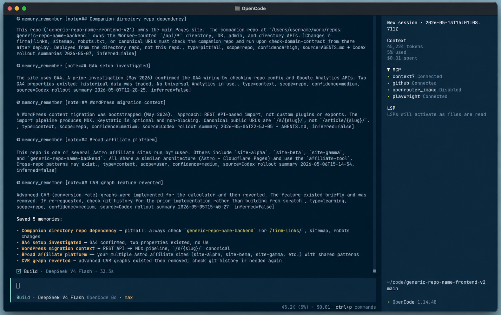

# OpenCode Memory Plugin

🧠 **Lightweight Markdown memory for OpenCode agents.**

OpenCode Memory gives your coding agent a small, inspectable memory layer without a vector database, MCP server, cloud account, background daemon, or hidden state. It stores durable project facts, user preferences, useful commands, pitfalls, and decisions in plain `MEMORY.md` files.

Use it when you want future OpenCode sessions in the same repo to remember the few things that actually matter, while keeping every note readable, editable, and easy to supersede when it becomes stale.



## Features

- ✍️ **Markdown-first**: memory is text you can read, diff, edit, and delete.
- 🗂️ **Repo-aware**: each repository gets its own memory file in a central OpenCode memory folder.
- 🌍 **Global notes**: keep cross-project user preferences separate from repo-specific facts.
- 🧭 **Agent-callable**: OpenCode agents get native tools like `memory_recall` and `memory_remember`.
- 🔎 **Codex-aware**: optionally search existing Codex memory read-only before promoting useful notes.
- 🪶 **Light by default**: no embeddings, no vector DB, no MCP server, no hosted service.
- 🚦 **Staleness-aware**: outdated notes are marked superseded instead of silently disappearing.
- 🔐 **Secret-conscious**: notes are lightly redacted before saving, and the policy tells agents not to store credentials.

## Quick Start

Clone and install locally:

```bash
git clone https://github.com/kab/opencode-memory-plugin.git
cd opencode-memory-plugin
npm install
npm run build
npm run install:local
```

Restart OpenCode, then try:

```text
/memory
/memory deploy
/remember This repo deploys from GitHub Actions on main.
/codex-memory opencode config
```

Headless OpenCode works too:

```bash
opencode run --command memory "deploy"
opencode run --command remember "This repo uses pnpm check before commits."
opencode run --command codex-memory "opencode slim"
```

Once the package is published, your OpenCode config can use the package name instead of a local `file://` checkout:

```jsonc
{
  "plugin": ["@kab/opencode-memory-plugin"]
}
```

## Give This To Your LLM Agent

Paste this into Codex, OpenCode, Claude Code, or another coding agent when you want it to install the plugin for you:

```text
Install the OpenCode Memory plugin from this repo.

Requirements:
- Create a timestamped backup of ~/.config/opencode/opencode.json before editing it.
- Run npm install, npm run build, and npm test.
- Add a file:// plugin entry for this checkout to ~/.config/opencode/opencode.json.
- Copy commands/*.md into ~/.config/opencode/commands/ unless they already exist; back up overwritten files.
- Do not store real memory data in the plugin repo.
- Verify that ~/.config/opencode/memory/projects.json exists.
- Verify with: opencode run --command memory "test"
```

## How It Works

Memory is stored outside the plugin source repo:

```text
~/.config/opencode/memory/
  global/
    MEMORY.md
  repos/
    <project-id>/
      MEMORY.md
  projects.json
```

Project ids are resolved in this order:

1. explicit aliases in `projects.json`
2. git remote identity
3. git common-dir/worktree identity
4. normalized path hash fallback

## Agent Tools

The plugin exposes these OpenCode tools:

| Tool | Purpose |
| --- | --- |
| `memory_recall` | Search global and repo memory. |
| `memory_remember` | Save a durable memory note. |
| `memory_supersede` | Mark an old memory superseded and optionally add a replacement. |
| `memory_list` | Show memory file locations and active/superseded counts. |
| `codex_memory_search` | Search Codex memory read-only. |

## Memory Policy

Memory is advisory, not authority.

- Current user instructions win.
- Current repo files and live systems win.
- If memory conflicts with reality, mark it superseded.
- Do not save secrets, credentials, raw tokens, or speculative claims as fact.
- If the agent saves memory autonomously, it should say what it saved.

## Example MEMORY.md

```md
# MEMORY.md

Policy: Advisory only. Verify current repo/live state before acting.

## Active
- 2026-05-13 | id=mem_abc123 | type=preference | scope=user | confidence=medium | source=user | inferred=false | User prefers end-of-task memory saves to be reported in chat.

## Superseded
- 2026-05-13 | id=mem_old123 | status=superseded | superseded_at=2026-05-14 | reason=changed | Old note text...
```

## Development

```bash
npm install
npm test
npm pack --dry-run
```

## Publishing Notes

Suggested GitHub description:

```text
Lightweight Markdown memory for OpenCode agents, with repo-scoped recall and optional Codex memory search.
```

Suggested GitHub topics:

```text
opencode opencode-plugin opencode-memory ai-agents coding-agent llm-memory agent-memory markdown-memory codex-memory repo-memory
```

## License

MIT
